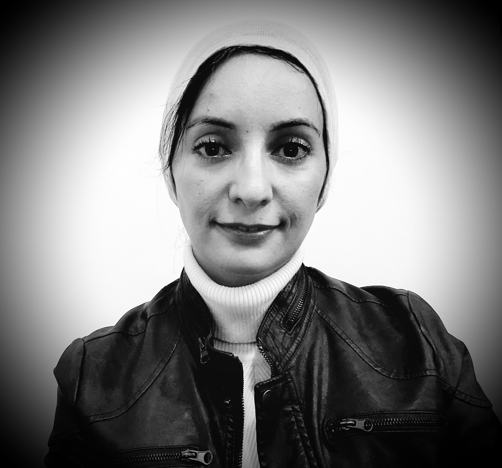

    

       

            
       

    

    

       

          
            
<b>Ghada Almashaqbeh</b>   Assistant Professor of Computer Science and Engineering   University of Connecticut 

            
 <b>Contact:</b>   <u>Email:</u> ghada at uconn.edu   <u>Office:</u> ITE 255   Storrs, CT

           
       

    

I am an assistant professor in the [Computer Science and Engineering](https://www.cse.uconn.edu/) department at UConn. I am an affiliated member at the [Connecticut Advanced Computing Center (CACC)](https://cacc.uconn.edu/) and the [Engineering for Human Rights Initiative](https://engineeringforhumanrights.uconn.edu/) at UConn. Before joining UConn, I spent a while exploring the entrepreneurship world. I cofounded CacheCash, a startup that came out of my PhD thesis! I also was a Cryptographer at [NuCypher](https://www.nucypher.com/). Now, I am a scientific advisor at Sunscreen Tech and The Melon.
 
I received my PhD in Computer Science from Columbia University in 2019, where I was a member of the [Cryptography Lab](http://www.cs.columbia.edu/crypto) and the [Data Science Institute](https://datascience.columbia.edu/). During the PhD I was fortunate to have [Allison Bishop](https://www.thecomputersciencecomedian.com) and [Tal Malkin](http://www.cs.columbia.edu/~tal) as my advisors. 

My [research interests](/research/) cover cryptography, computer systems security, and privacy, with a focus on blockchain-based systems and distributed cryptographic protocols.

My research is supported by NSF and UConn Research Excellence Program (REP) Award.

 

---------------------------------------
**<u>Recruiting:</u>** **I am looking for self-motivated and talented PhD students to join my group for Fall 2022.** If you are interested in working on timely and real-world problems in the fields of cryptography, privacy, and systems security, feel free to contact me! 

---------------------------------------