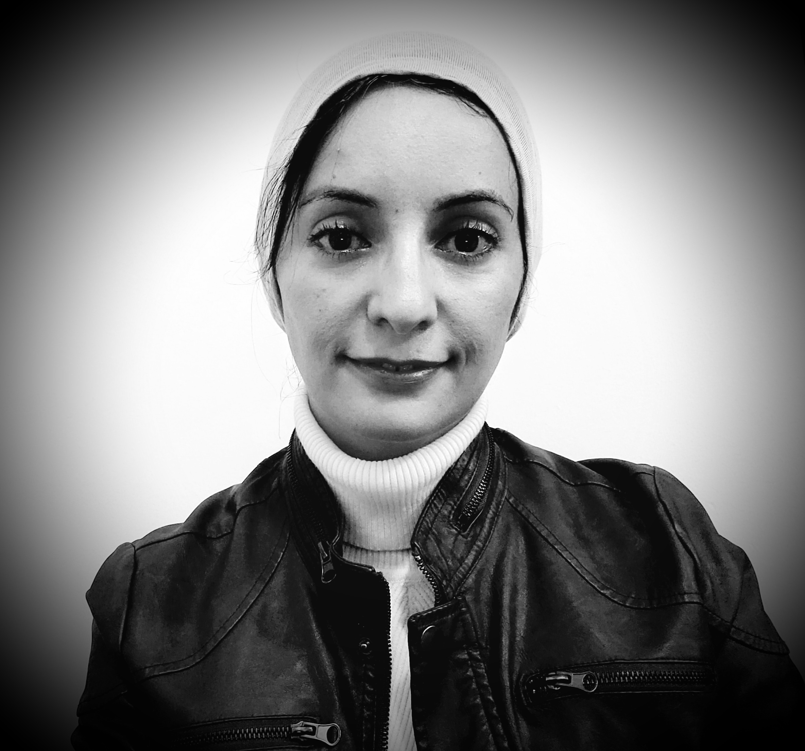

    

       

            
       

    

    

       

          
            
<b>Ghada Almashaqbeh</b>   Assistant Professor of Computer Science   University of Connecticut 

            
 <b>Contact:</b>   <u>Email:</u> ghada at uconn.edu       

           
       

    

I am an assistant professor in the School of Computing at UConn. I am also affiliated with the Connecticut Advanced Computing Center (CACC) and the Engineering for Human Rights Initiative. Before joining UConn, I spent a while exploring the entrepreneurship world. I cofounded CacheCash, a startup that came out of my PhD thesis, and I was a Cryptographer at NuCypher. Also, I was an advisor for the Melon and Sunscreen, a 2023 Foresight Institute fellow, and a 2023 TLDR fellow at Uniswap Foundation. 

I received my PhD in Computer Science from Columbia University in 2019, where I was a member of the Cryptography Lab and the Data Science Institute. During the PhD, I was fortunate to have Allison Bishop and Tal Malkin as my advisors. 
 
My research interests span cryptography, systems security, and privacy, with a primary focus on distributed cryptographic protocols, privacy-preserving computing, and blockchain-based systems. A central theme of my work is bridging theory and practice; I design secure and efficient systems and protocols that connect rigorous cryptographic foundations with real-world applications, particularly in decentralized and heterogeneous settings.

My research is supported by NSF, Protocol Labs, Uniswap Foundation, and UConn Research Excellence Award.

 

---------------------------------------
**<u>Recruiting:</u>** I am always looking for self-motivated and talented Postdocs and PhD students to join my group. If you are interested in working on timely and real-world problems in the fields of cryptography, privacy, and systems security, feel free to drop me an email with your CV! 

---------------------------------------