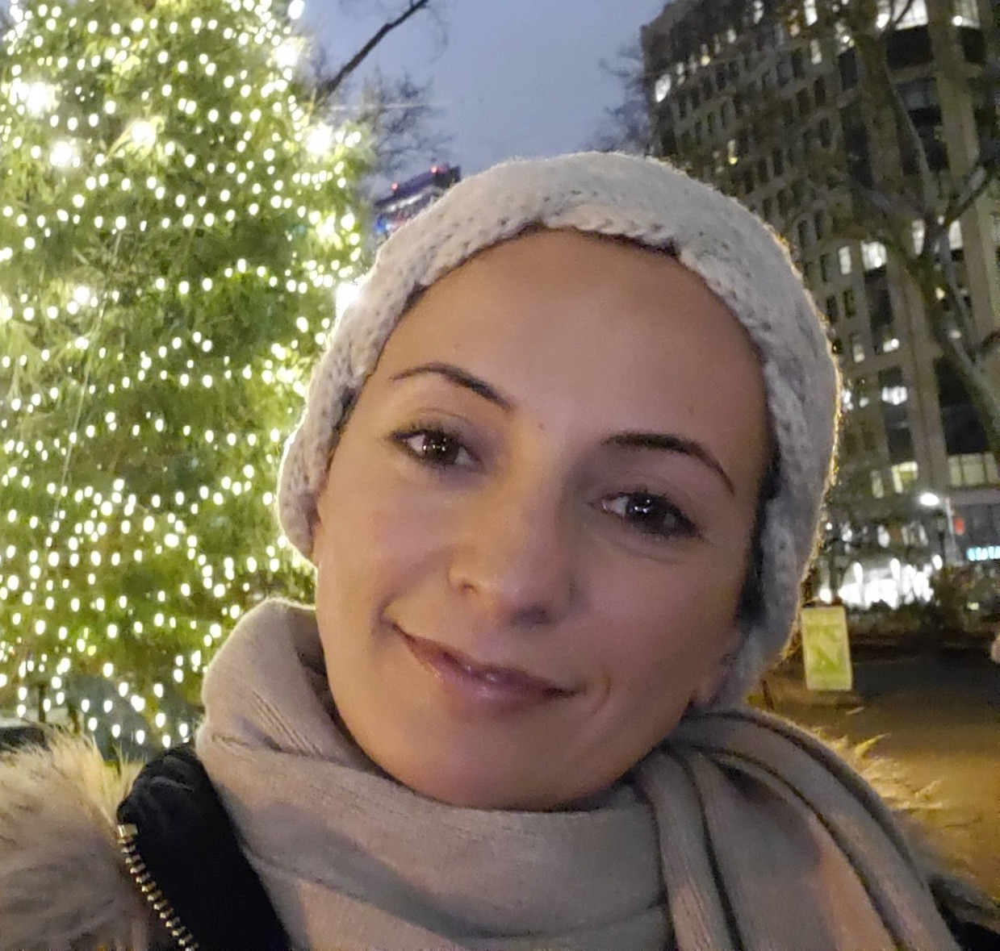

    

       

            
       

    

    

       

          
            
<b>Ghada Almashaqbeh</b>   Assistant Professor of Computer Science and Engineering   University of Connecticut 

            
 <b>Contact:</b>   <u>Email:</u> ghada at uconn.edu   <u>Office:</u> ITE 255   371 Fairfield Way   Storrs, CT  06269

           
       

    

I am an assistant professor in the [Computer Science and Engineering](https://www.cse.uconn.edu/) department at UConn. My [research interests](/research/) cover cryptography, computer systems security, and privacy. I am an affiliated member at the [Connecticut Advanced Computing Center (CACC)](https://cacc.uconn.edu/) and the [Engineering for Human Rights Initiative](https://engineeringforhumanrights.uconn.edu/) at UConn. Before joining UConn, I spent a while exploring the entrepreneurship world. I cofounded CacheCash, a decentralized cryptocurrency-based content delivery network (CDN), which was the core work I've done for my PhD thesis! I also worked as a Cryptographer at [NuCypher](https://www.nucypher.com/). Now, I am a scientific advisor for Sunscreen Tech.
 
I received my PhD in Computer Science from Columbia University in 2019, where I was a member of the [Cryptography Lab](http://www.cs.columbia.edu/crypto) and the [Data Science Institute](https://datascience.columbia.edu/). During the PhD I was fortunate to have [Allison Bishop](https://www.thecomputersciencecomedian.com) and [Tal Malkin](http://www.cs.columbia.edu/~tal) as my advisors. 

**<u>News:</u>**

**Feb 2022** Will speak at USENIX Enigma'22 about privacy in the blockchain era

**Feb 2022** Will speak at Protocol Labs Research Seminar Series about our work Gage MPC

**Jan 2022** Will serve on the PC of Asiacrypt'22

**Nov 2021** A panelist in WISP/BLF event “Exploring the Interplay of Privacy, Security, and Blockchain Technologies”

**Sep 2021** Our paper “Bet and Attack: Incentive Compatible Collaborative Attacks Using Smart Contracts” has been accepted in GameSec'21

**Jul 2021** Will speak at Google Cryptography Talks Series about our work Gage MPC

**May 2021** Our paper “Gage MPC: Bypassing Residual Function Leakage for Non-Interactive MPC" has been accepted in PETS'21 

**May 2021** A panelist in SYF event “Blockchain Coffee Talk”

**Feb 2021** Received Teaching Excellence recognition from the provost

**Jan 2021** Will serve on the PC of Crypto'21

**Dec 2020** Our article "Building secure decentralized services and resource markets" has been accepted in USENIX ;login: magazine

**Oct 2020** Will speak at GHC about decentralized services and resource markets.

**Aug 2020** Joined UConn's CSE department!
